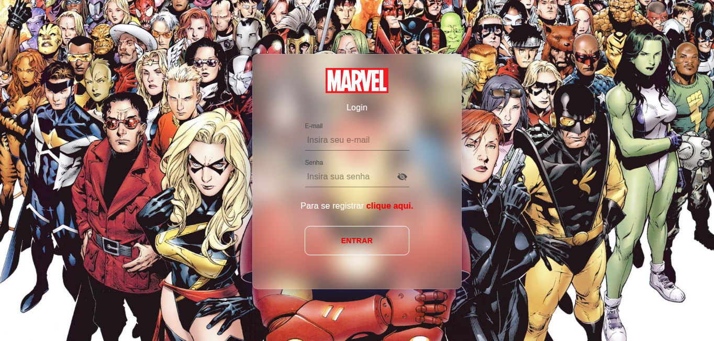
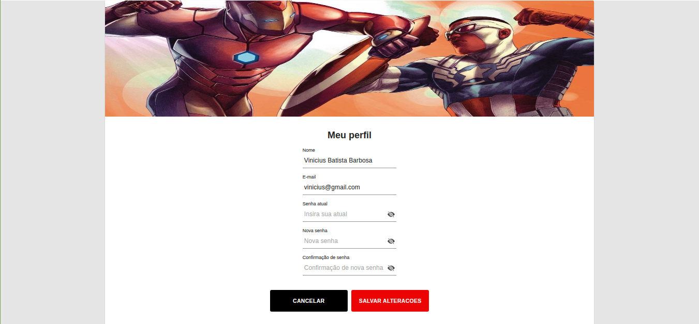

# Stone Challenge Client

The project consists of a client-side application where you will find all the information about the Marvel comics and characters.

 

`Login`:

  

    
  

`Register`:

  

    
  

`Dashboard`:

  

    
  

`Update Profile`:

  

    
  

`Search Comics`:

  

    
  

  

    
  

  

    
  

  

    
  

 

## Technologies used

- [React](https://github.com/facebook/react)
- [MaterialUi](https://github.com/mui-org/material-ui)
- [Styled-Components](https://github.com/styled-components/styled-components)
- [Unform](https://github.com/unform/unform)

 

## Running the application in a development environment

- Clone this repository with the command:  git clone https://github.com/vbbarbosa97/stone-challenge-client.git

- Have NPM or Yarn installed.

- Install the project dependencies with the command:  `npm install` or `yarn install`.

- After installing the dependencies, execute the command:  `yarn start` or `npm start`.
